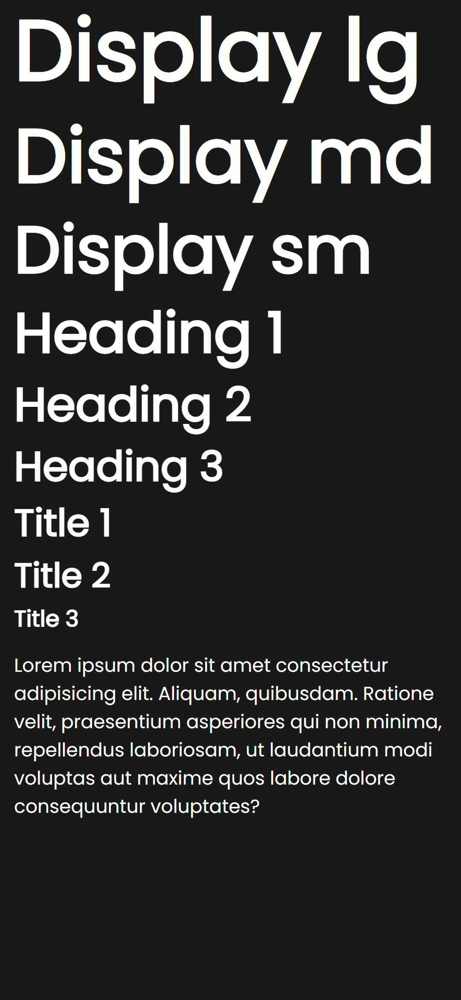

# Typography

example of usage of typography classes

## Display Headings

Display texts are meant to stand out from others, even from headlines and titles.

There are three sizes: **lg**, **md** and **sm**.

You can use display headings by using these classses:

`.display-lg`

`.display-md`

`.display-sm`

## Headings

There are 6 sizes of headings from 1, the bigger, to 6, the smaller one.

`h1` or either `.h1`

`h2` or either `.h2`

`h3` or either `.h3`

`h4` or either `.h4`

`h5` or either `.h5`

`h6` or either `.h6`

# Paragraph

You can use the paragraph by simply using the html tag `p`.
