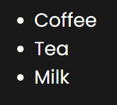
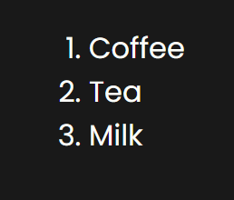
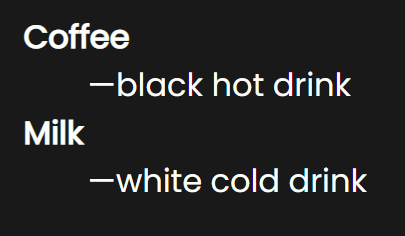
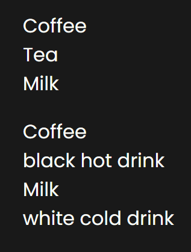

# Lists

## Unordered list

```html
<ul>
  <li>Coffee</li>
  <li>Tea</li>
  <li>Milk</li>
</ul>
```



## Ordered List

```html
<ol>
  <li>Coffee</li>
  <li>Tea</li>
  <li>Milk</li>
</ol>
```



## Definition list

```html
<dl>
  <dt>Coffee</dt>
  <dd>black hot drink</dd>
  <dt>Milk</dt>
  <dd>white cold drink</dd>
</dl>
```



## Unstyled list

You can delete all list styles with the class `.list-unstyled`


