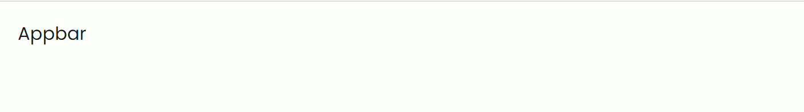
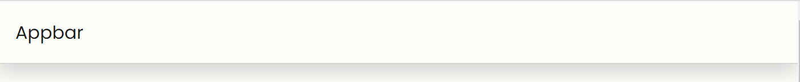
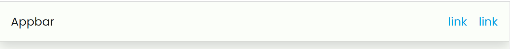
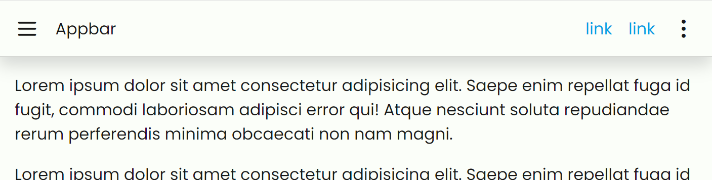
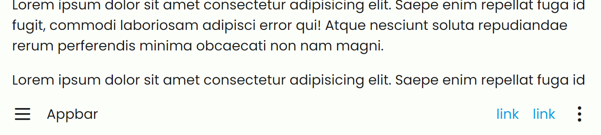

# Appbar

The examples below use **tabler icons** to use it you should include their css stylesheet!

```html
<link
  rel="stylesheet"
  href="https://cdn.jsdelivr.net/npm/@tabler/icons@latest/iconfont/tabler-icons.min.css"
/>
```

---

## Simple Appbar

```html
<nav class="appbar">
  <div class="container">
    <div class="appbar-title">Appbar</div>
  </div>
</nav>
```



## Elevation

It is possible to give some shadows to the appbar by adding the class `.elevated` to the appbar itself.

```html
<nav class="appbar elevated">
  <div class="container">
    <div class="appbar-title">Appbar</div>
  </div>
</nav>
```



## Nav inside

It is possible to put navs inside the appbar to enclose links:

```html
<nav class="appbar elevated">
  <div class="container">
    <div class="appbar-title">Appbar</div>
    <nav>
      <a href="#">link</a>
      <a href="#">link</a>
    </nav>
  </div>
</nav>
```

You can even use lists inside the nav. Rootscss will take care of the style with no classes.

```html
<nav class="appbar elevated">
  <div class="container">
    <div class="appbar-title">Appbar</div>
    <nav>
      <ul>
        <li>
          <a href="#">link</a>
        </li>
        <li>
          <a href="#">link</a>
        </li>
      </ul>
    </nav>
  </div>
</nav>
```

The result will be the same.



# Buttons

You can put icon buttons too.

```html
<nav class="appbar elevated">
  <div class="container">
    <button class="icon-button"><i class="ti ti-menu-2"></i></button>
    <div class="appbar-title">Appbar</div>
    <nav>
      <ul>
        <li>
          <a href="#">link</a>
        </li>
        <li>
          <a href="#">link</a>
        </li>
      </ul>
    </nav>
    <button class="icon-button"><i class="ti ti-dots-vertical"></i></button>
  </div>
</nav>
```

## Positioning

You can choose to assign a position to the appbar by adding one of these classes:

`.sticky` will stick to appbar on top of the document

`.fixed-top` will fix the appbar on top of the document

`.fixed-bottom` will fix the appbar on the bottom of the document



