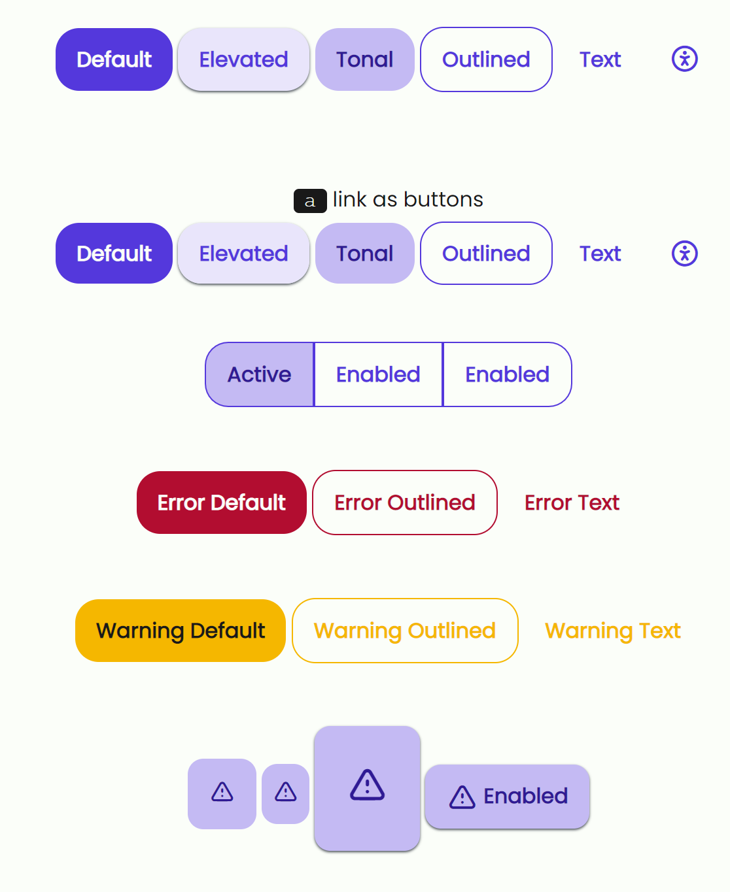

# Buttons

```html
<div class="container-md pt-5">
  <button class="btn">Default</button>
  <button class="btn btn-elevated">Elevated</button>
  <button class="btn btn-tonal">Tonal</button>
  <button class="btn btn-outlined">Outlined</button>
  <button class="btn btn-text">Text</button>
  <button class="btn btn-icon"><i class="ti ti-accessible"></i></button>
</div>

<div class="container-md py-3">
  <p><code>a</code> link as buttons</p>
  <a class="btn" href="#">Default</a>
  <a class="btn btn-elevated" href="#">Elevated</a>
  <a class="btn btn-tonal" href="#">Tonal</a>
  <a class="btn btn-outlined" href="#">Outlined</a>
  <a class="btn btn-text" href="#">Text</a>
  <a class="btn btn-icon" href="#"><i class="ti ti-accessible"></i></a>
</div>

<div class="container-md pb-3">
  <div class="btn-group justify-content-center">
    <button class="btn btn-active">Active</button>
    <button class="btn">Enabled</button>
    <button class="btn">Enabled</button>
  </div>
</div>

<div class="container-md pb-3">
  <button class="btn btn-error">Error Default</button>
  <button class="btn btn-outlined btn-error">Error Outlined</button>
  <button class="btn btn-text btn-error">Error Text</button>
</div>

<div class="container-md pb-3">
  <button class="btn btn-warning">Warning Default</button>
  <button class="btn btn-outlined btn-warning">Warning Outlined</button>
  <button class="btn btn-text btn-warning">Warning Text</button>
</div>

<div class="container-md pb-5">
  <button class="btn btn-fab"><i class="ti ti-alert-triangle"></i></button>
  <button class="btn btn-fab-extended">
    <i class="ti ti-alert-triangle"></i> Enabled
  </button>
</div>
```


