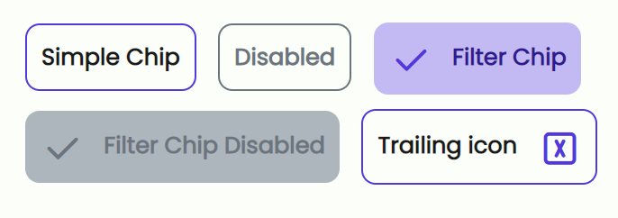

# Chips

This example uses tabler-icons. To use them you have to include their stylesheet:

```html
<link
  rel="stylesheet"
  href="https://cdn.jsdelivr.net/npm/@tabler/icons@latest/iconfont/tabler-icons.min.css"
/>
```

---

```html
<span class="chip">Simple Chip</span>
<span class="chip chip-disabled">Disabled</span>
<span class="chip chip-filter">
  <i class="ti ti-check chip-leading-icon"></i> Filter Chip
</span>
<span class="chip chip-filter chip-disabled">
  <i class="ti ti-check chip-leading-icon"></i> Filter Chip Disabled
</span>
<span class="chip">
  Trailing icon <i class="ti ti-square-x chip-trailing-icon"></i>
</span>
```


