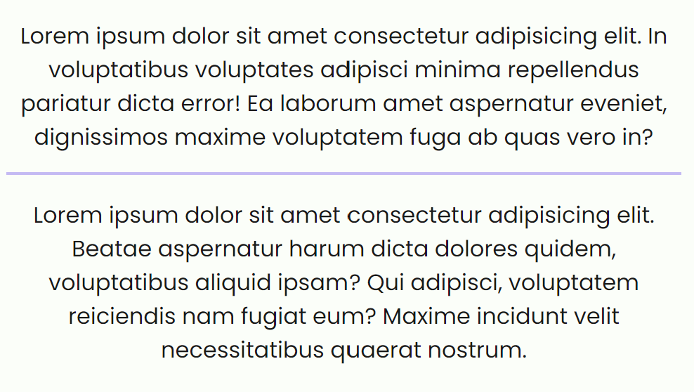

# Divider

You can use he `hr` html tag to use the divider:

```html
<div class="container-sm">
  <p>
    Lorem ipsum dolor sit amet consectetur adipisicing elit. In voluptatibus
    voluptates adipisci minima repellendus pariatur dicta error! Ea laborum amet
    aspernatur eveniet, dignissimos maxime voluptatem fuga ab quas vero in?
  </p>

  <hr />

  <p>
    Lorem ipsum dolor sit amet consectetur adipisicing elit. Beatae aspernatur
    harum dicta dolores quidem, voluptatibus aliquid ipsam? Qui adipisci,
    voluptatem reiciendis nam fugiat eum? Maxime incidunt velit necessitatibus
    quaerat nostrum.
  </p>
</div>
```


