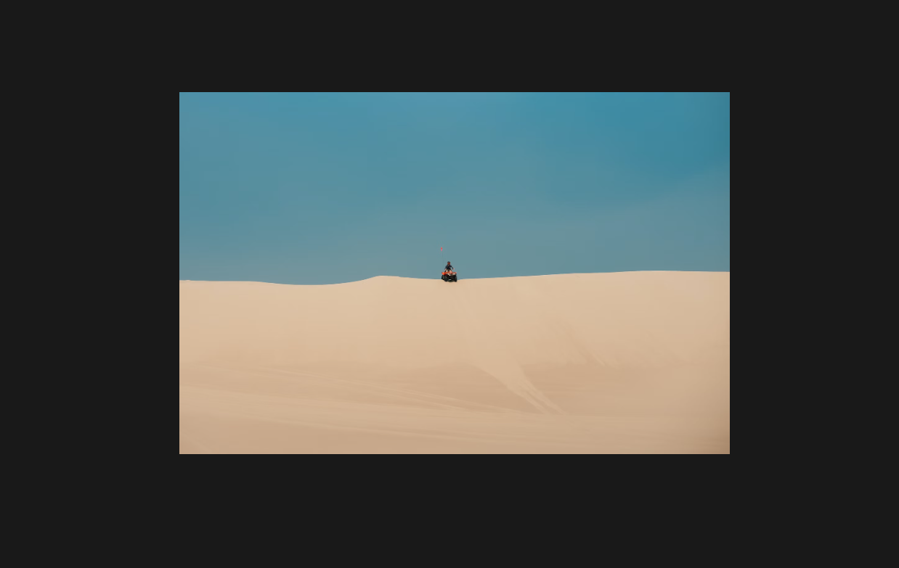

# Images

Images are rendered with their actual width and height. If you want to make the image side as the parent element the image is inside, you have to use the `.img-fluid` class on the `img` html tag.

