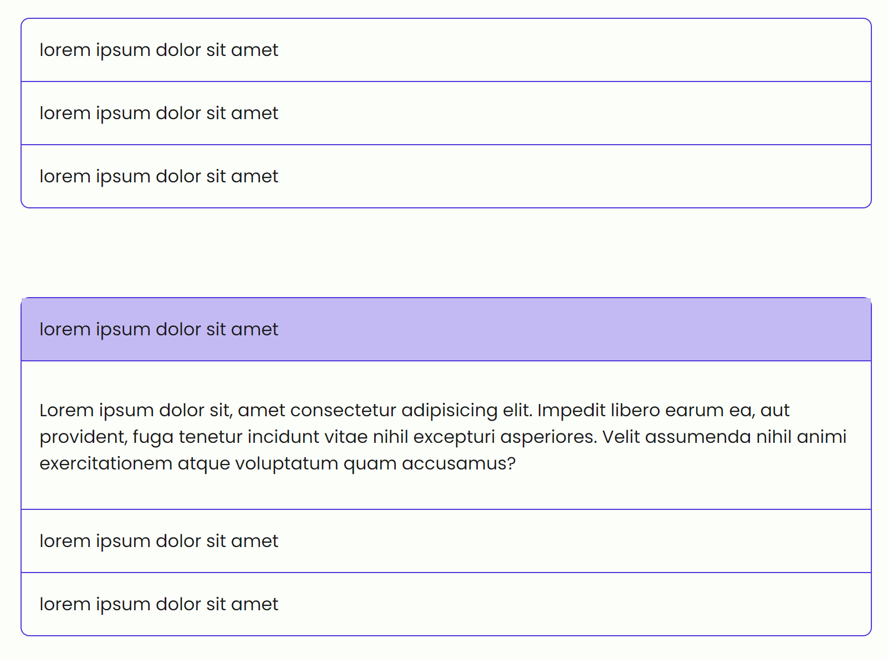

# Accordions

```html
<div class="accordion">
  <div class="accordion-item" data-collapse="show">
    <div class="accordion-header">lorem ipsum dolor sit amet</div>
    <div class="accordion-body">
      <p>
        Lorem ipsum dolor sit, amet consectetur adipisicing elit. Impedit libero
        earum ea, aut provident, fuga tenetur incidunt vitae nihil excepturi
        asperiores. Velit assumenda nihil animi exercitationem atque voluptatum
        quam accusamus?
      </p>
    </div>
  </div>

  <div class="accordion-item">
    <div class="accordion-header">lorem ipsum dolor sit amet</div>
    <div class="accordion-body">
      <p>
        Lorem ipsum dolor sit, amet consectetur adipisicing elit. Impedit libero
        earum ea, aut provident, fuga tenetur incidunt vitae nihil excepturi
        asperiores. Velit assumenda nihil animi exercitationem atque voluptatum
        quam accusamus?
      </p>
    </div>
  </div>

  <div class="accordion-item">
    <div class="accordion-header">lorem ipsum dolor sit amet</div>
    <div class="accordion-body">
      <p>
        Lorem ipsum dolor sit, amet consectetur adipisicing elit. Impedit libero
        earum ea, aut provident, fuga tenetur incidunt vitae nihil excepturi
        asperiores. Velit assumenda nihil animi exercitationem atque voluptatum
        quam accusamus?
      </p>
    </div>
  </div>
</div>
```

with `data-collapse="show"` you can initialize the accordion item opened.


