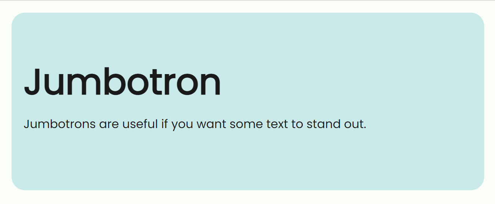
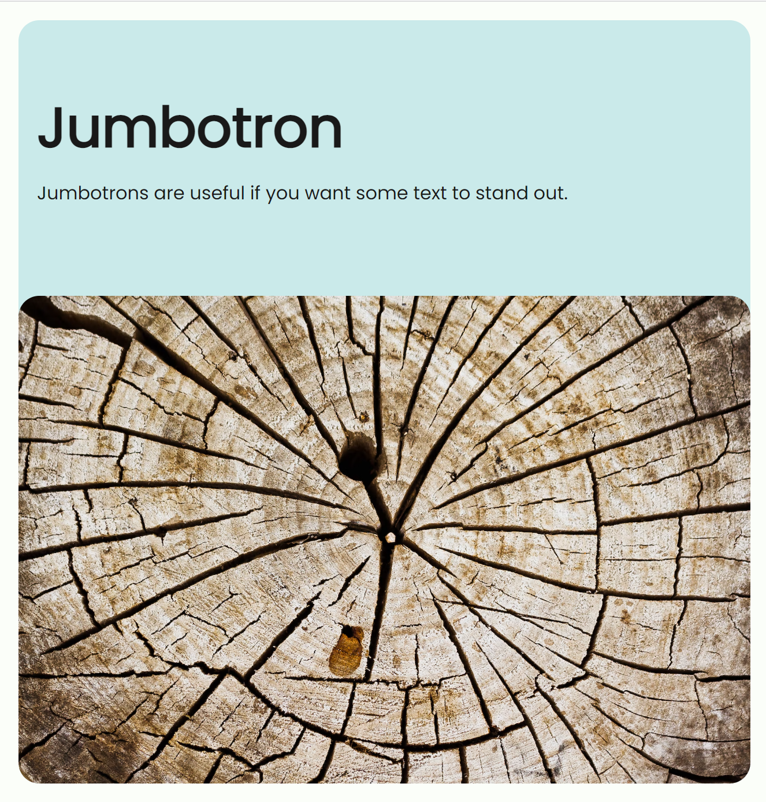
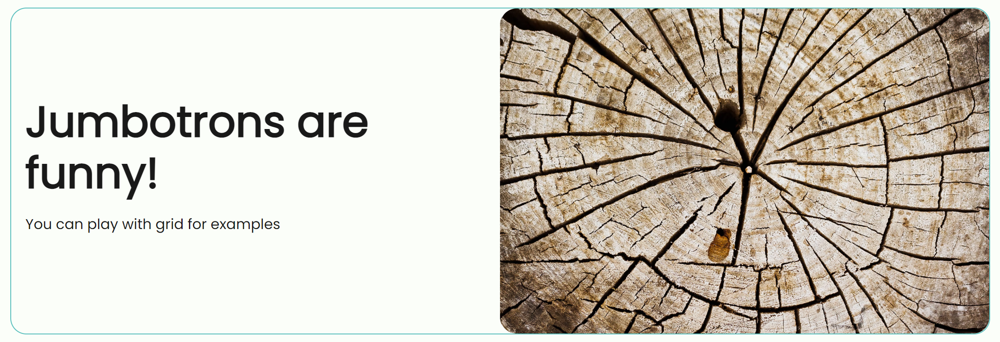

# Jumbotrons

Jumbotrons are useful if you want some text to stand out from the rest. You can put images into it too!

```html
<div class="container">
  <div class="jumbotron">
    <div class="jumbotron-body d-absolute">
      <h1>Jumbotron</h1>
      <p>Jumbotrons are useful if you want some text to stand out.</p>
    </div>

    
  </div>
</div>
```




## Outlined with grid

```html
<div class="container">
  <div class="jumbotron outlined">
    <div class="grid align-items-center">
      <div class="grid-col-6">
        <div class="jumbotron-body">
          <h1>Jumbotrons are funny!</h1>
          <p>You can play with grid for examples</p>
        </div>
      </div>
      <div class="grid-col-6">
        
      </div>
    </div>
  </div>
</div>
```


