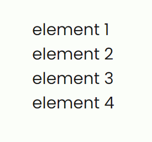

# Navs

```html
<nav class="nav">
  <ul>
    <li>element 1</li>
    <li>element 2</li>
    <li>element 3</li>
    <li>element 4</li>
  </ul>
</nav>
```



```html
<nav class="nav inline">
  <ul>
    <li>element 1</li>
    <li>element 2</li>
    <li>element 3</li>
    <li>element 4</li>
  </ul>
</nav>
```


```html
<nav class="nav">
  <a href="#">Link 1</a>
  <a href="#">Link 2</a>
  <a href="#">Link 3</a>
  <a href="#">Link 4</a>
</nav>
```


