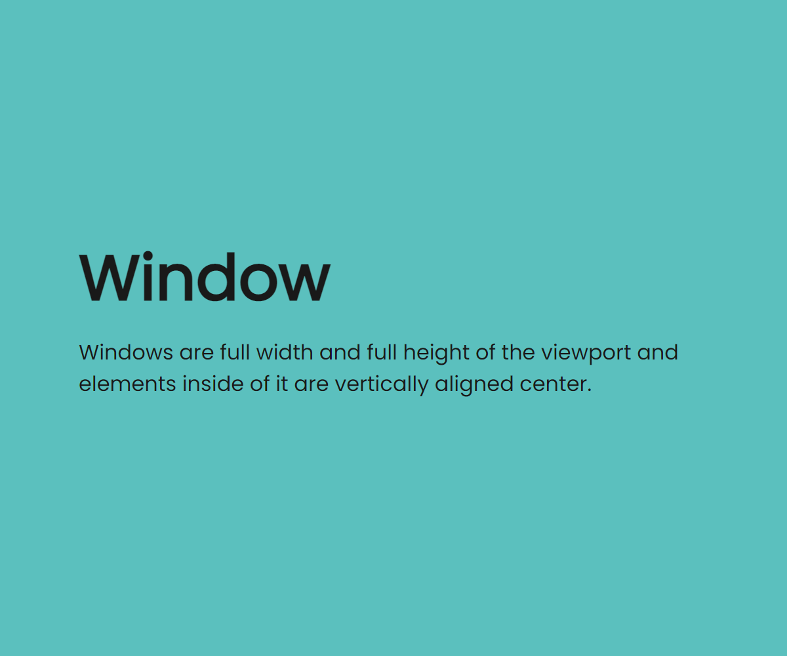

# Windows

Windows are as big as the viewport and elements inside them are vertically aligned center.

```html
<div class="window bg-terziary">
  <div class="container-sm">
    <h1>Window</h1>
    <p>
      Windows are full width and full height of the viewport and elements inside
      of it are vertically aligned center.
    </p>
  </div>
</div>
```


