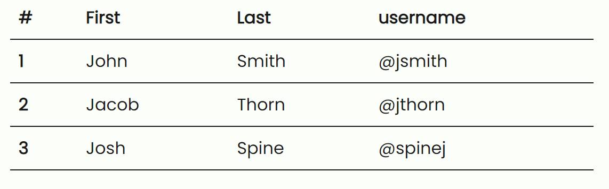
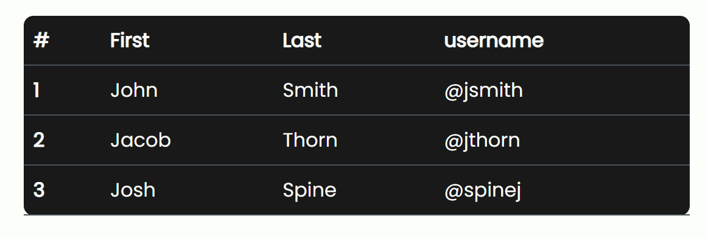
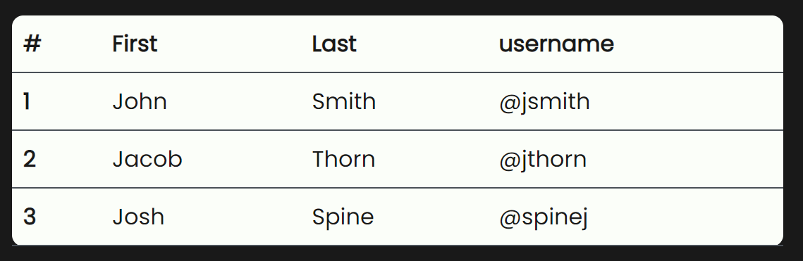
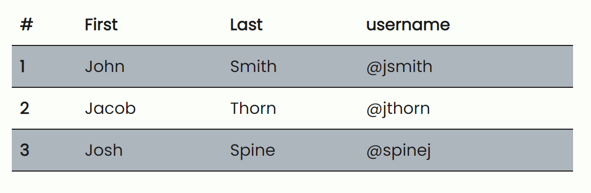
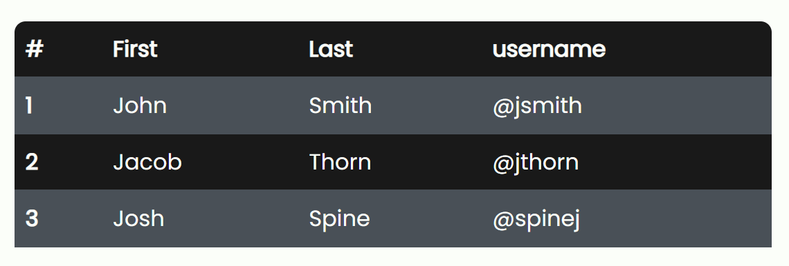

# Tables

To use the table style just add a `.table` class in the `table` html tag.

## Dark

`.table .table-dark`

## Table light

Works only with the dark theme.

`.table .table-light`

## Striped

Just use `.table .table-striped` classes in the `table` html tag.

And the dark version: `.table .table-dark .table-striped`

