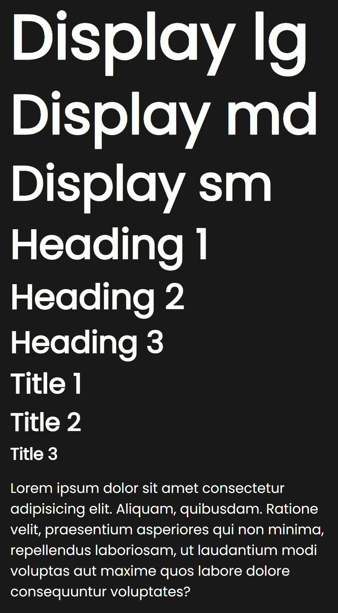
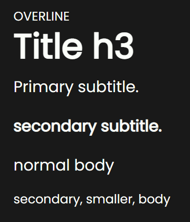
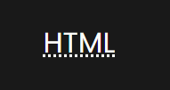
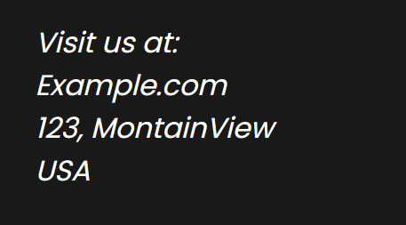
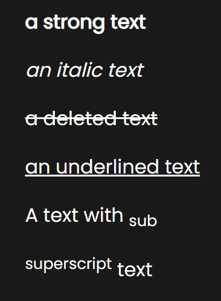

# Typography

Example of usage of typography classes

## Display Headings

Display texts are meant to stand out from others, even from headlines and titles.

There are three sizes: **lg**, **md** and **sm**.

You can use display headings by using these classses:

`.display-lg`

`.display-md`

`.display-sm`

## Headings

There are 6 sizes of headings from 1, the bigger, to 6, the smaller one.

`h1` or either `.h1`

`h2` or either `.h2`

`h3` or either `.h3`

`h4` or either `.h4`

`h5` or either `.h5`

`h6` or either `.h6`

## Overline

A bit of paragraph that goes above titles. You can use it by calling the class `.overline`.

## Subtitles

There are two subheadings: `.subtitle` and `.subtitle-2`.

## Paragraph

You can use the paragraph by simply using the html tag `p`.

There's even a smaller paragraph and you can use it by calling the class `.body-2`.

## Links

You can use the link component by simply using the html tag `a`

## Abbreviations

You can use the abbreviation component by simply using the html tag `abbr`, or the deprecated tag `acronym`.

## Address

You can use the address component by simply using the html tag `address`.

## Inline elements

`b`, `strong`

`i`, `em`

`del`, `s`, `strike`

`ins`, `u`

`sub`, `.sub`

`sup`, `.sup`

